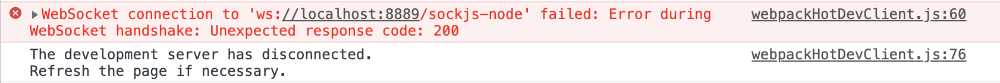
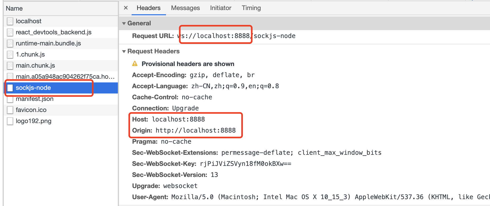
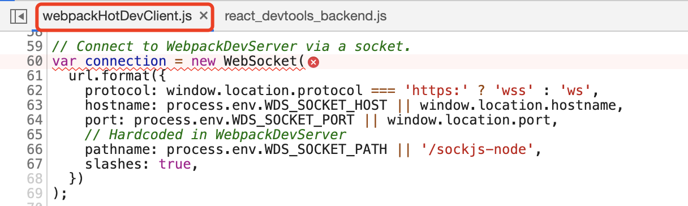

<!--
 * @Author: Li Zhiliang
 * @Date: 2020-10-28 11:31:07
 * @LastEditors: Li Zhiliang
 * @LastEditTime: 2020-10-28 11:43:15
 * @FilePath: /React-learning/knowledge/entranceConfig.md
-->
# 多入口配置

由于我们的项目分了很多个端（官网、两个 PC 中台、一个 PC 后台、一个移动端后台）。对于后台来说，在 PC 端和移动端都有的情况下（移动端就是 PC 版的阉割版本），一些帮助方法、业务逻辑等都是一致的，所以我们将这两个端放在同一个项目下进行开发。
为了实现这样的目的，我们需要对原有的 webpack 配置进行扩展，让它支持多入口。

## 1. 添加移动端相关的文件

在项目根目录下添加相关文件：

- index-m.js：移动端入口文件。

- public/mobile.html：移动端 html 模板文件。

- AppMobile.js：添加移动端的相关配置构成组件，在 index-m.js 中进行引入。

而原有的 index.js、public/index.html、App.js 则作为 PC 端的相关文件。

修改 config-overrides.js：

```js
const { override } = require('customize-cra')

const multipleEntry = require('react-app-rewire-multiple-entry')([
  {
    entry: 'src/index-m.js',
    template: 'public/mobile.html',
    outPath: '/mobile.html'
  }
])

const customWebpack = () => config => {
  multipleEntry.addMultiEntry(config)
  return config
}

module.exports = {
  webpack: override(
    customWebpack(),
  )
}
```

这里我们就已经将移动端的入口文件添加到原有的 webpack 配置中了，下面进行一下测试（可以分别在 App.js 和 AppMobile.js 中添加一些内容，只要方便自己区分是 PC 端还是移动端即可）。

重新执行 npm start，分别访问 http://localhost:3002/index.html 和 http://localhost:3002/mobile.html（这里大家根据自己项目运行的端口访问）。结果一切都是那么美好~。

## 2. 设置代理

但是问题来了，我们最初的目的是希望区分多个端，而不是将其变成多页应用，其本质还是单页应用，要怎么办呢？

我们现在是通过 index.html 和 mobile.html 的后缀来进行区分的，如果可以改用端口或域名区分，那是不是就可以解决这个问题呢，我的思路是通过 Nginx 配置代理（Nginx
相关基础知识可以参照：Nginx基础知识入门，从零到一的实践），根据不同的端口访问不同的端。心动不如行动，尝试一下~

添加 Nginx 配置，并重启 sudo nginx -s reload：

```js
server {
  listen 8888;
  server_name localhost;

  location / {
    proxy_pass http://127.0.0.1:3002;
  }
}

server {
  listen 8889;
  server_name localhost;

  location ~ ^[^.]*$ {
    rewrite /(.*) /mobile.html break;
    proxy_pass http://127.0.0.1:3002;
  }
  location / {
    proxy_pass http://127.0.0.1:3002;
  }
}
```

访问 http://localhost:8888/ 和 http://localhost:8889/，看着好像没问题，but...

## 3. 修改 websocket

打开控制台，我看到了如下图所示的报错信息（为什么一个是 404，一个是 200，我也不知道，有知道的大佬还请赐教）：



打开控制台，我看到了如下图所示的报错信息（为什么一个是 404，一个是 200，我也不知道，有知道的大佬还请赐教）：

首先我们看一下 network 中 sockjs-node 请求的相关信息：



连接失败的原因就在这里，因为我们的项目实际运行是在 3002 端口上的，而当我们使用 Nginx 设置了代理后，我们访问的是 8888 端口和 8889 端口。所以，我们只需要保持发送 sockjs-node 请求的端口还是 3002 就能解决这个问题了。

也就是说，我们需要确认在创建 websocket 连接的时候，是怎么设置的 url，进而将其设置为我们想要的值。

找到原因和解决方案之后，可以舒一口气了（至少有了方向）。下面我们看一下具体报错的位置（点击控制台输出的错误信息 webpackHotDevClient.js:60）：



看到这里是不是有种恍然大悟的感觉呢，成功离我们已经不远啦！从这段代码我们可以知道，如果设置了 WDS_SOCKET_HOST 和 WDS_SOCKET_PORT，则直接取对应的值；如果没有设置，则取当前的访问域名和端口。最终拼接为 websocket 连接的 url。

所以，我们只需要在环境配置里面指定 WDS_SOCKET_HOST 和 WDS_SOCKET_PORT 为我们想要的域名和端口就可以解决这个问题了。在 .env.development 文件中（热更新正常只需要在开发环境中使用）添加以下内容：

```js
WDS_SOCKET_HOST=127.0.0.1
WDS_SOCKET_PORT=3002
```

重新运行项目 npm start，分别访问 http://localhost:8888/ 和 http://localhost:8889/，没有报错，大功告成~


